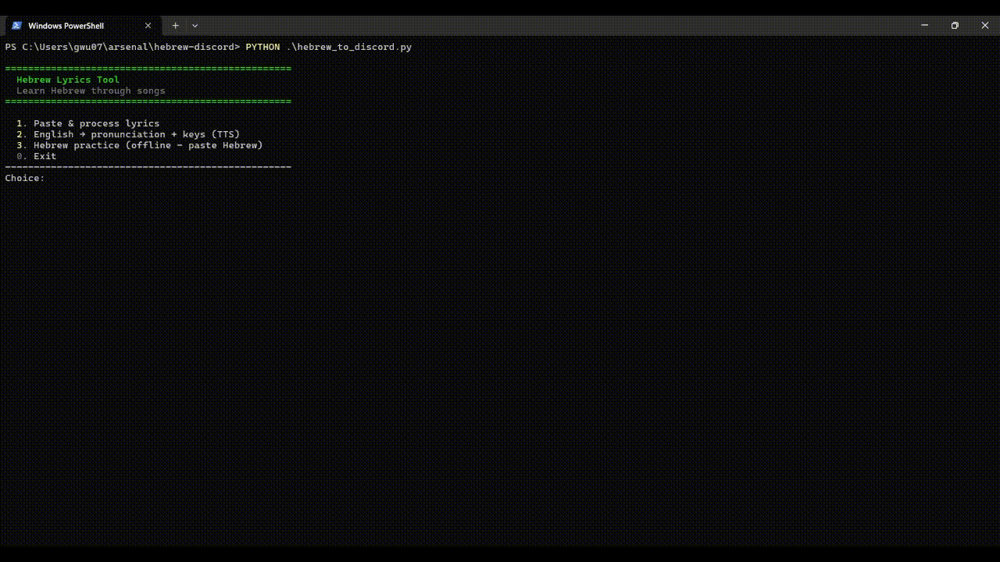
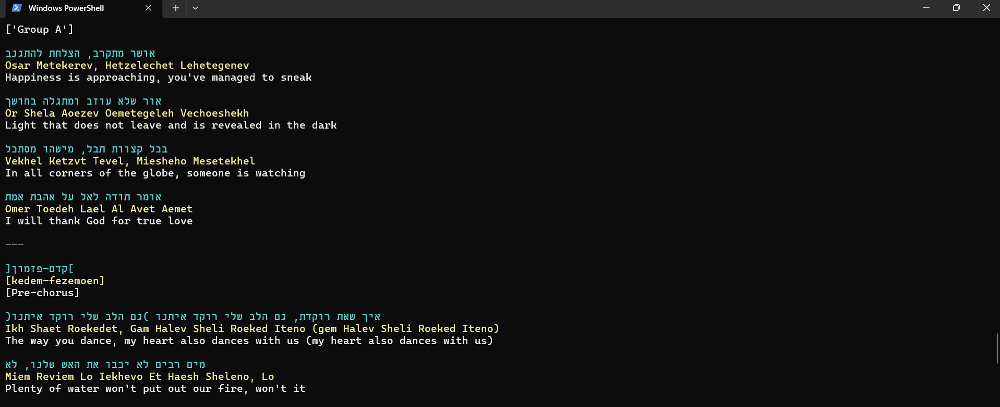
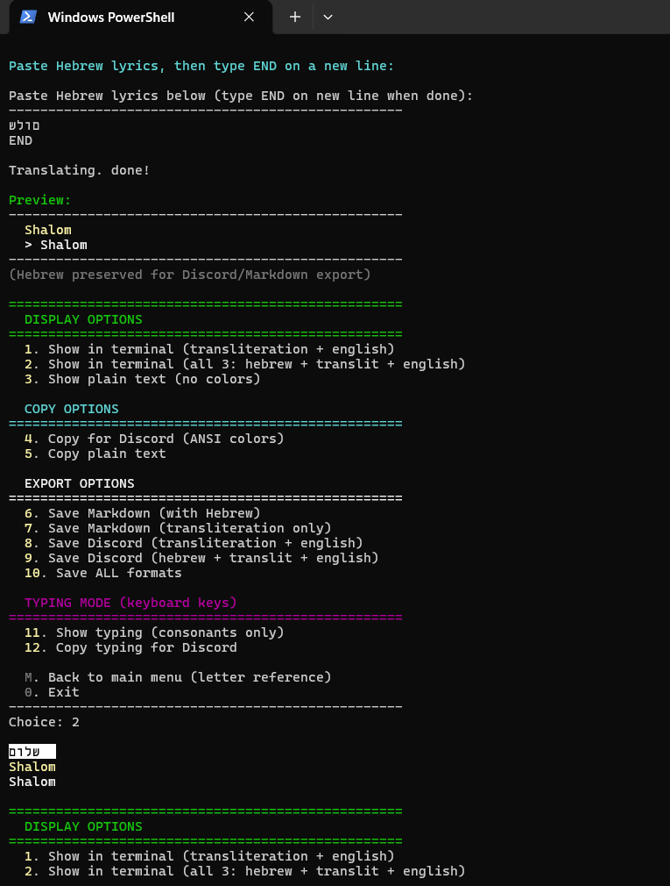

# Hebrew Discord Formatter

Learn Hebrew through songs. Paste lyrics, get pronunciation + translation + Discord colors. Practice typing with Windows Hebrew keyboard.

---

**הכלי הזה מוקדש לחבר הישראלי שלי שלימד אותי כל מה שידעתי על CSEC כשלא היה צריך - לב זהב**

*This tool is dedicated to my Israeli friend who taught me everything I knew about CSEC when he didn't have to - a heart of gold.*

He gave me knowledge, patience, and mentorship when no one else would.

יום אחד אני מקווה שאוכל לכתוב לך בשפה שלך כהערכה

---






## Install

```powershell
pip install -r requirements.txt
pip install edge-tts  # optional: for Hebrew TTS
```

Requirements: `pyperclip`, `deep-translator`, `edge-tts` (optional)

## Usage

```powershell
python hebrew_to_discord.py
```

## Main Menu

| Option | Description |
|--------|-------------|
| 1 | Paste & process lyrics (copy from websites) |
| 2 | English → pronunciation + keys + TTS |
| 3 | Hebrew practice (offline - paste Hebrew) |

## Option 1: Lyrics Workflow

Best for learning songs. Copy Hebrew lyrics from websites (Genius, etc.) and paste.

1. Paste Hebrew lyrics
2. Type `END` on new line
3. Choose from output options

### Display (Terminal)
| Option | Description |
|--------|-------------|
| 1 | Show transliteration + English |
| 2 | Show all 3: Hebrew + transliteration + English |
| 3 | Show plain text (no colors) |

Note: Terminal Hebrew is reversed for PowerShell display. Use copy/export options for correct Hebrew.

### Copy (Clipboard)
| Option | Description |
|--------|-------------|
| 4 | Copy Discord ANSI (correct Hebrew for Discord) |
| 5 | Copy plain text |

### Export (Save to File)
| Option | Description |
|--------|-------------|
| 6 | Save Markdown (with Hebrew) |
| 7 | Save Markdown (transliteration only) |
| 8 | Save Discord (translit + english) - auto-chunks |
| 9 | Save Discord (hebrew + translit + english) - auto-chunks |
| 10 | Save ALL formats |

### Typing Mode
| Option | Description |
|--------|-------------|
| 11 | Show typing (keyboard keys to press) |
| 12 | Copy typing for Discord |
| M | Back to main menu |

## Option 2: English → Pronunciation

Type English words, get:
- **Say:** pronunciation (transliteration)
- **Type:** keyboard keys for Windows Hebrew
- **TTS:** audio plays automatically

Note: Hebrew text output removed (translation API unreliable). Use option 1/3 for reliable Hebrew.

## Option 3: Hebrew Practice (Offline)

Paste Hebrew text directly. No internet needed.

- **Say:** pronunciation
- **Type:** keyboard keys
- **TTS:** audio plays

## Windows Hebrew Keyboard

Visual QWERTY → Hebrew reference:

```
  ┌───┬───┬───┬───┬───┬───┬───┬───┬───┬───┐
  │ Q │ W │ E │ R │ T │ Y │ U │ I │ O │ P │
  │ / │ ' │ ק │ ר │ א │ ט │ ו │ ן │ ם │ פ │
  ├───┼───┼───┼───┼───┼───┼───┼───┼───┼───┤
  │ A │ S │ D │ F │ G │ H │ J │ K │ L │ ; │
  │ ש │ ד │ ג │ כ │ ע │ י │ ח │ ל │ ך │ ף │
  ├───┼───┼───┼───┼───┼───┼───┼───┼───┼───┤
  │ Z │ X │ C │ V │ B │ N │ M │ , │ . │
  │ ז │ ס │ ב │ ה │ נ │ מ │ צ │ ת │ ץ │
  └───┴───┴───┴───┴───┴───┴───┴───┴───┴───┘
```

### Setup
1. Windows Settings → Time & Language → Language
2. Add Hebrew (use "Hebrew" layout, not "Standard")
3. Win+Space to switch keyboards

### Example Words

| English | Hebrew | Say | Type |
|---------|--------|-----|------|
| peace/hello | שלום | Shalom | AKUO |
| thanks | תודה | Toda | ,USV |
| yes | כן | Ken | FI |
| no | לא | Lo | KT |
| what | מה | Ma | NV |
| love | אהבה | Ahava | TVCT |

## Features

### TTS (Text-to-Speech)
- Hebrew pronunciation plays automatically
- Uses Microsoft Edge neural voices
- Requires `edge-tts` and internet

### Transliteration (Offline)
- 40+ common Hebrew words pre-mapped
- Vowel inference for unknown words

### Windows Hebrew Keyboard
- Visual QWERTY → Hebrew map
- Shows exact keys (AKUO not "shalom")
- Works with Windows Standard Hebrew layout

### Auto-Chunking
- Discord limit: 2000 chars without Nitro
- Export options auto-split into multiple files

### PowerShell RTL
- Terminal display reverses Hebrew for readability
- Copy/export options preserve correct Hebrew
